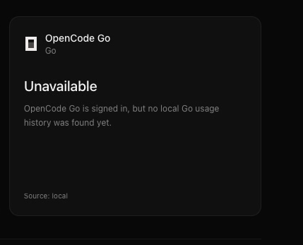
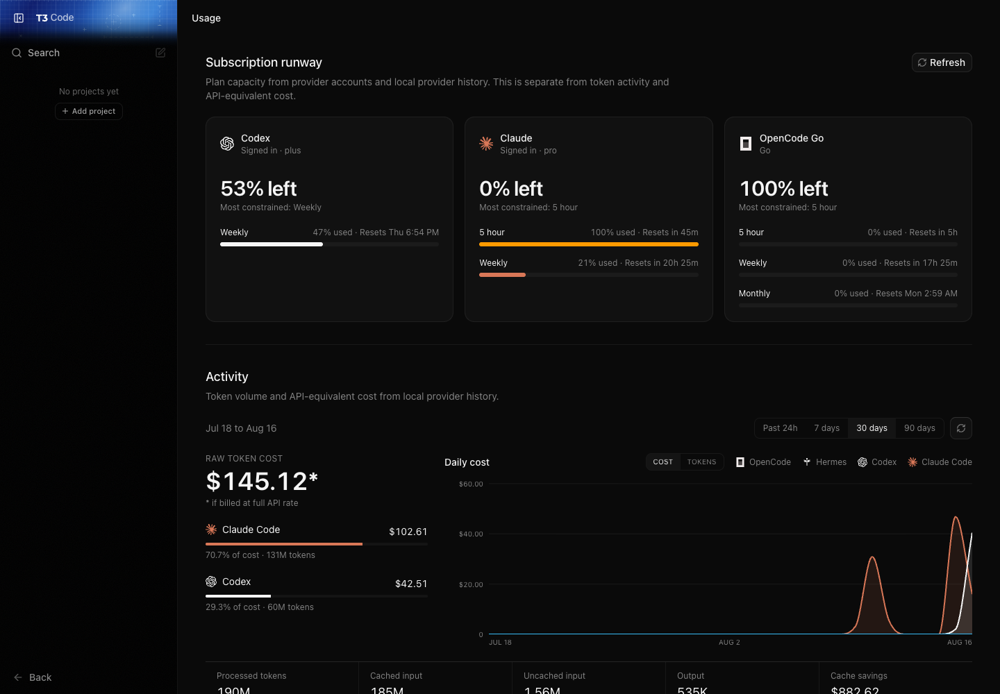

# Provider quota UI evidence

## Before

OpenCode Go authentication was detected, but the card could not load quota data.

## After

Codex, Claude, and OpenCode Go limits now share one page with provider activity. Account identifiers are redacted in this capture.

